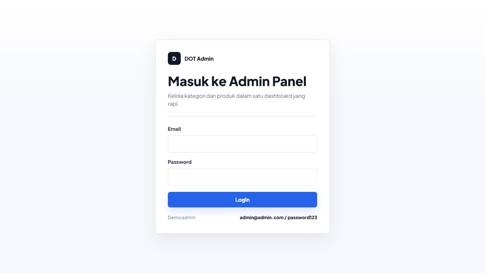
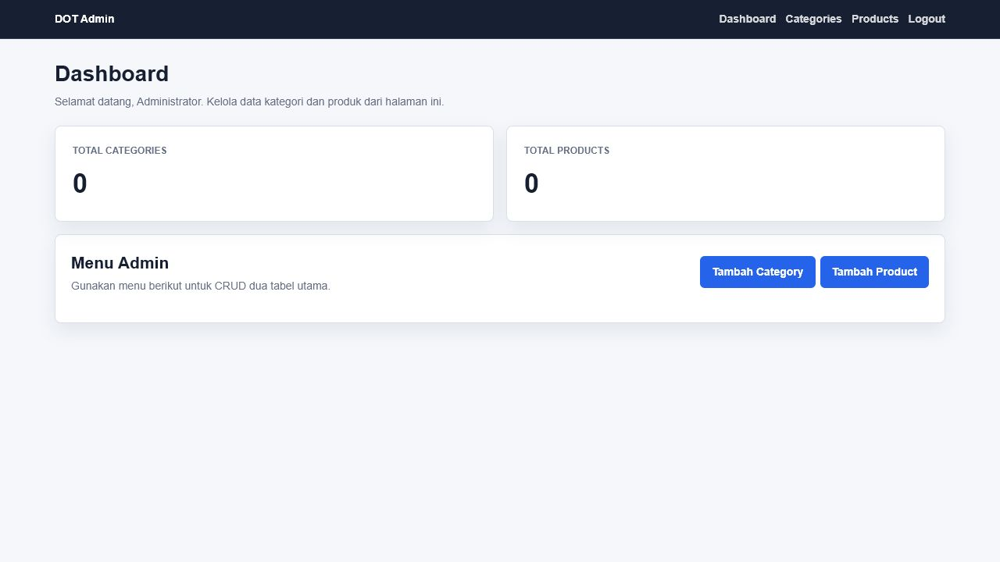
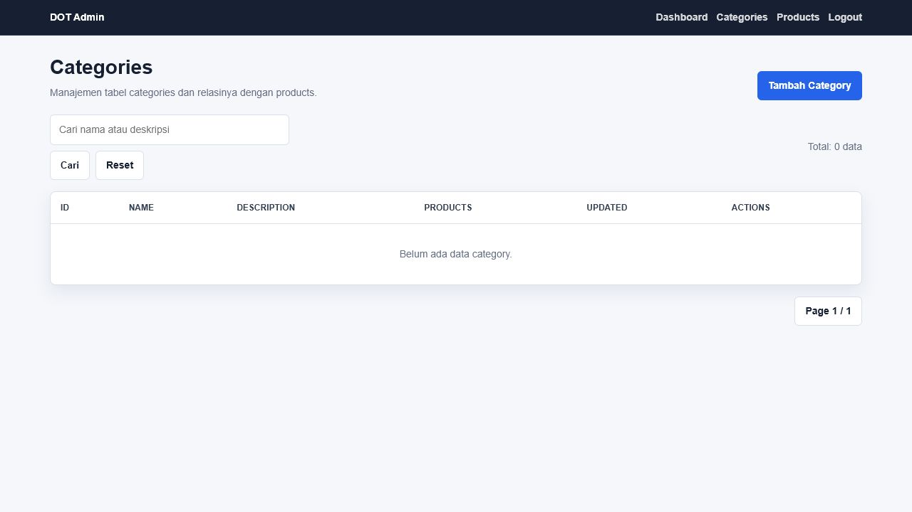
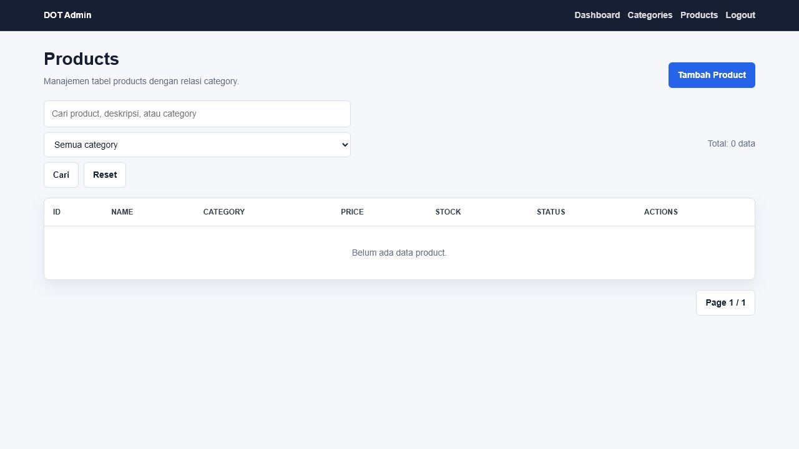

# Fullstack Challenge DOT - Admin Panel

Admin panel berbasis NestJS TypeScript untuk mengelola data `categories` dan `products` dengan fitur login, CRUD, list, detail, pencarian, filter kategori, API untuk testing Postman, dan tampilan page menggunakan Handlebars.

## Fitur

- Login admin menggunakan session Passport.
- Dashboard ringkasan jumlah categories dan products.
- CRUD `categories`.
- CRUD `products`.
- Upload gambar product melalui form admin panel.
- Relasi one-to-many: satu category memiliki banyak products.
- Halaman list dan detail untuk dua tabel utama.
- Pencarian category berdasarkan name/description.
- Pencarian product berdasarkan name/description/category.
- Filter product berdasarkan category.
- API endpoint untuk testing Postman setelah login.
- Error handling untuk data tidak ditemukan, validasi relasi category, login gagal, dan delete category yang masih memiliki product.

## Tech Stack dan Dependency

- Node.js
- NestJS TypeScript
- TypeORM
- better-sqlite3
- Passport dan passport-local
- express-session
- bcrypt
- hbs
- class-validator dan class-transformer
- Jest dan Supertest

## Desain Database

Desain database mengikuti requirement pada gambar challenge.

```dbml
Table users {
  id int [pk, increment]
  name varchar(100) [not null]
  email varchar(100) [not null, unique]
  password varchar(255) [not null]
  role varchar(20) [not null]
  created_at timestamp [not null]
  updated_at timestamp [not null]
}

Table categories {
  id int [pk, increment]
  name varchar(100) [not null]
  description text
  created_at timestamp [not null]
  updated_at timestamp [not null]
}

Table products {
  id int [pk, increment]
  category_id int [not null, ref: > categories.id]
  name varchar(150) [not null]
  description text
  price decimal(12, 2) [not null]
  stock int [not null]
  image_url varchar(255)
  status varchar(20) [not null]
  created_at timestamp [not null]
  updated_at timestamp [not null]
}
```

Relasi:

- `categories.id` ke `products.category_id`
- One-to-many: 1 category dapat memiliki banyak product.

## Screenshot Aplikasi

### Login



### Dashboard



### Categories



### Products



## Cara Setup

Install dependency:

```bash
npm install
```

Jalankan aplikasi:

```bash
npm run start
```

Mode development:

```bash
npm run start:dev
```

Buka aplikasi:

```text
http://localhost:3000
```

Database menggunakan SQLite lokal pada file:

```text
database.sqlite
```

TypeORM `synchronize` aktif untuk kebutuhan challenge/development sehingga tabel dibuat otomatis dari entity.

## Akun Login

Seeder admin dibuat otomatis saat aplikasi start.

```text
Email    : admin@admin.com
Password : password123
Role     : admin
```

## Struktur Project

```text
src/
  app.controller.ts          # Controller halaman MVC admin panel
  app.module.ts              # Root module dan konfigurasi TypeORM
  main.ts                    # Bootstrap, session, passport, view engine, helper HBS
  auth/                      # Login, local strategy, session serializer, guard
  categories/                # Controller API, service, DTO category
  products/                  # Controller API, service, DTO product
  users/                     # Service user dan seed admin
  entities/                  # Entity User, Category, Product
views/
  login.hbs
  dashboard.hbs
  error.hbs
  categories/
  products/
public/css/app.css
public/uploads/
docs/screenshots/
```

## Implementasi MVC

- Model: entity TypeORM di `src/entities`.
- View: template Handlebars di `views`.
- Controller: page controller di `src/app.controller.ts` dan API controller di module category/product.
- Service: business logic dan akses repository di `src/categories/categories.service.ts`, `src/products/products.service.ts`, dan `src/users/users.service.ts`.

## Endpoint Page

| Method | URL | Keterangan |
| --- | --- | --- |
| GET | `/login` | Halaman login |
| POST | `/login` | Proses login |
| GET | `/logout` | Logout |
| GET | `/` | Dashboard |
| GET | `/admin/categories` | List dan search categories |
| GET | `/admin/categories/create` | Form create category |
| POST | `/admin/categories/create` | Simpan category baru |
| GET | `/admin/categories/:id` | Detail category |
| GET | `/admin/categories/:id/edit` | Form edit category |
| POST | `/admin/categories/:id/edit` | Update category |
| GET | `/admin/categories/:id/delete` | Delete category |
| GET | `/admin/products` | List, search, filter products |
| GET | `/admin/products/create` | Form create product |
| POST | `/admin/products/create` | Simpan product baru |
| GET | `/admin/products/:id` | Detail product |
| GET | `/admin/products/:id/edit` | Form edit product |
| POST | `/admin/products/:id/edit` | Update product |
| GET | `/admin/products/:id/delete` | Delete product |

## Endpoint API untuk Postman

Login terlebih dahulu agar Postman menyimpan cookie session.
Upload file gambar tersedia pada form product di admin panel. Endpoint API tetap menerima `image_url` agar pengujian Postman sederhana.

| Method | URL | Keterangan |
| --- | --- | --- |
| POST | `/api/auth/login` | Login API |
| GET | `/api/auth/profile` | Profil user login |
| POST | `/api/auth/logout` | Logout API |
| GET | `/api/categories?page=1&limit=10&search=...` | List categories |
| GET | `/api/categories/:id` | Detail category |
| POST | `/api/categories` | Create category |
| PUT | `/api/categories/:id` | Update category |
| DELETE | `/api/categories/:id` | Delete category |
| GET | `/api/products?page=1&limit=10&search=...&category_id=1` | List products |
| GET | `/api/products/:id` | Detail product |
| POST | `/api/products` | Create product |
| PUT | `/api/products/:id` | Update product |
| DELETE | `/api/products/:id` | Delete product |

Contoh body create category:

```json
{
  "name": "Electronics",
  "description": "Produk elektronik"
}
```

Contoh body create product:

```json
{
  "category_id": 1,
  "name": "Keyboard Mechanical",
  "description": "Keyboard untuk kerja dan gaming",
  "price": 350000,
  "stock": 10,
  "image_url": "https://example.com/keyboard.jpg",
  "status": "active"
}
```

## Error Handling

- Login gagal menampilkan pesan pada halaman login.
- Data category/product tidak ditemukan akan menampilkan halaman error.
- Product tidak bisa dibuat atau diupdate jika `category_id` tidak valid.
- Category tidak bisa dihapus jika masih memiliki product.
- DTO menggunakan `class-validator` untuk validasi request API.
- Nest exception bawaan tetap digunakan untuk response API seperti `NotFoundException` dan `BadRequestException`.

## Testing

Build:

```bash
npm run build
```

Unit test:

```bash
npm test
```

E2E test:

```bash
npm run test:e2e
```

## Checklist Video Demo

Saat membuat video demo, pastikan menampilkan:

- Login.
- CRUD categories.
- CRUD products.
- Testing semua endpoint API di Postman.
- Penjelasan fitur dan alasan data yang ditampilkan.
- Penjelasan MVC pada source code.
- Penjelasan error handling.
